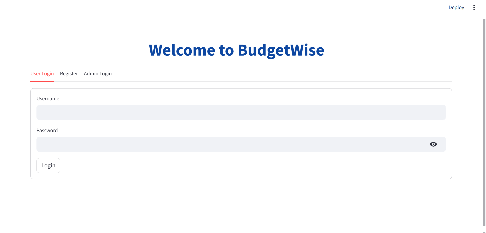
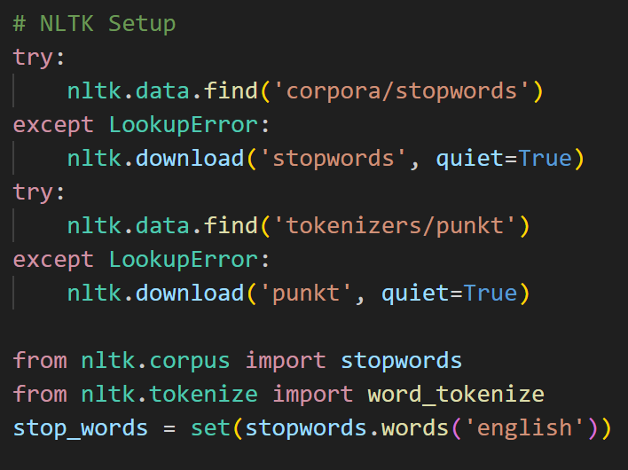
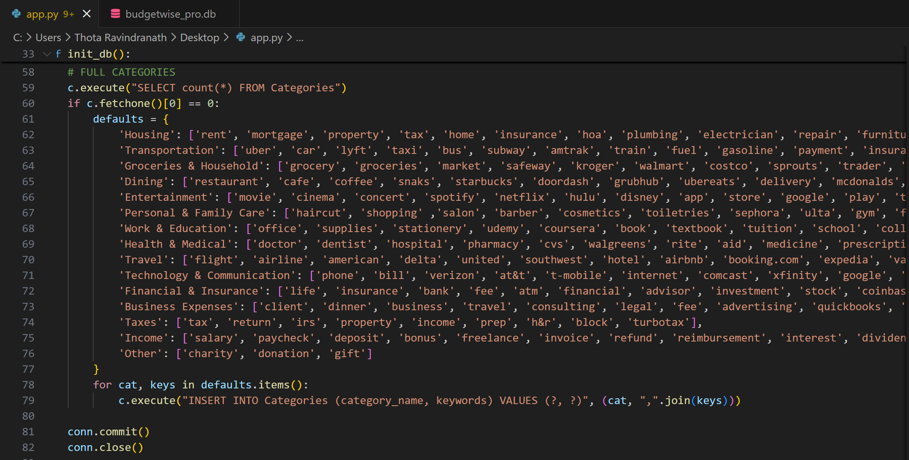
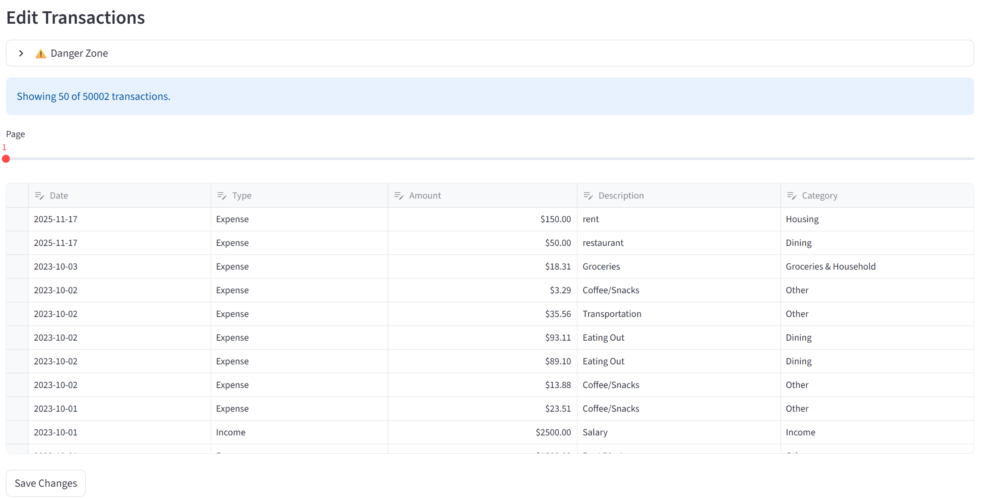
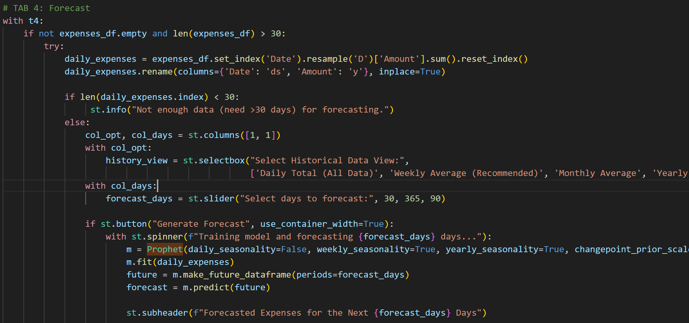
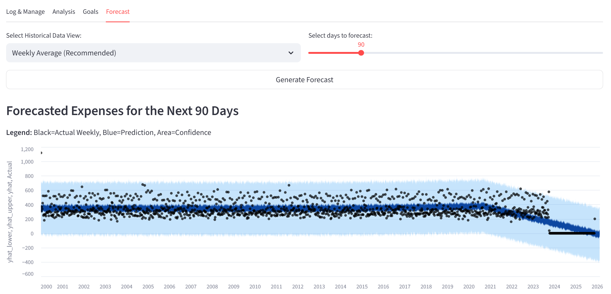
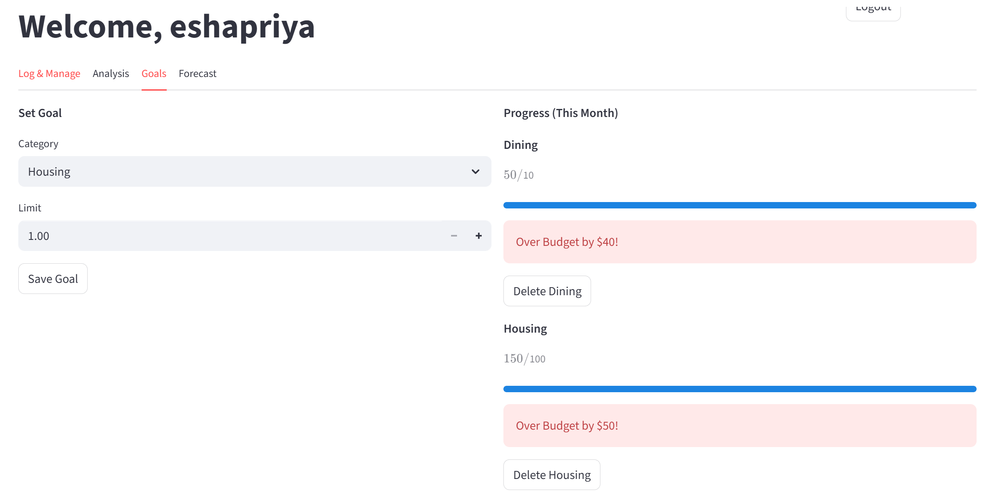
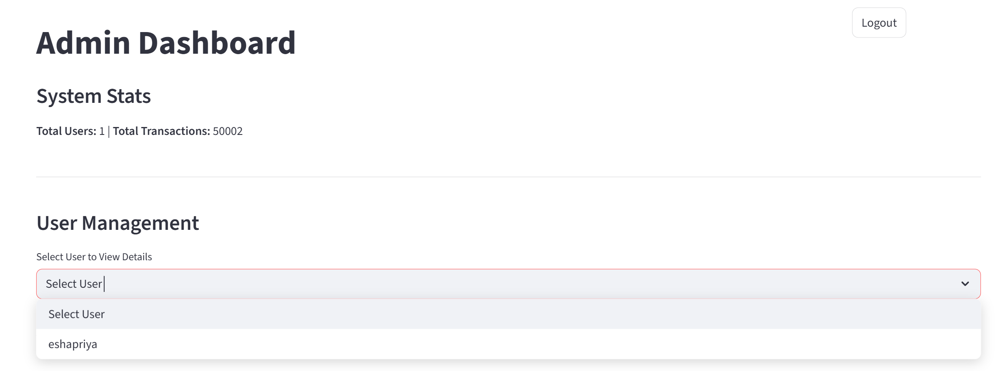
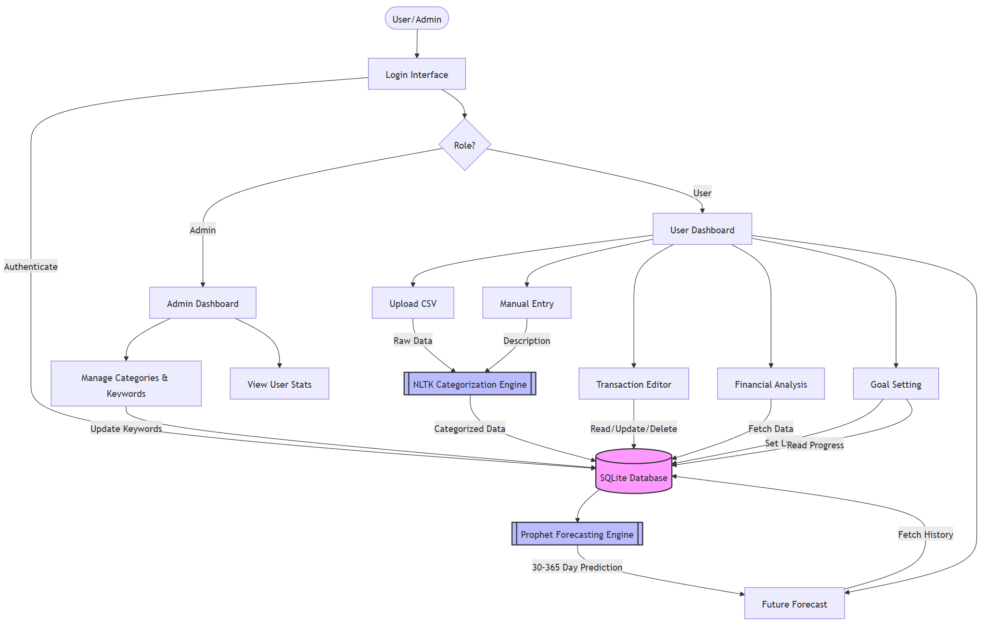

# Project Documentation: BudgetWise AI-Based Expense Forecasting Tool

## 1.0 Introduction
The BudgetWise AI-Based Expense Forecasting Tool is a smart, data-driven application designed to help individuals and businesses manage their finances proactively. The tool tracks user expenses, automatically categorizes them, and leverages Artificial Intelligence (AI) and Machine Learning (ML) models to forecast future spending patterns. By providing predictive insights and actionable alerts, it empowers users to maintain their budgets, anticipate overspending, and make informed financial decisions.

## 2.0 Problem Statement
Effective budget management is a common challenge for many. The core problems this project aims to address are:
* Unconscious Overspending: Many people overspend without a clear, real-time understanding of their financial habits.
* Inefficiency of Manual Budgeting: Traditional methods of manually tracking expenses are often time-consuming, tedious, and prone to human error.
* Difficulty in Future Planning: Accurately estimating future expenses is difficult, making long-term financial planning and savings a significant challenge.

## 3.0 Outcomes
* Clear Financial Overview: Provide users with an easy-to-understand dashboard of their income, expenses, and savings.
* Automated Expense Forecasting: Predict future spending based on historical data, helping users anticipate financial needs.
* Spending Pattern Identification: Automatically categorize transactions and highlight key spending areas.
* Goal-Oriented Planning: Assist users in setting and tracking progress towards financial goals (e.g., saving for a down payment, retirement).
* Data-Driven Insights: Empower users to identify areas for potential savings and improve budgeting habits.
* User-Friendly Interface: An intuitive platform for inputting transactions, viewing reports, and interacting with forecasts.

## 4.0 Modules to be implemented
* User Authentication & Profile Management:
  * User registration, login(standard email/pass)
  * Basic user profile for managing financial data and preferences
* Transaction Ingestion & Categorization Module:
  * Interface for users to manually input or upload simulated/dummy transaction data (ee.g., CSV).
  * Automated (or semi-automated, rule-based) categorization of transactions (e.g., 'Groceries', 'Utilities', 'Transport').
* Data Analysis & Reporting Module:
  * Calculate spending summaries per category, month, or custom period.
  * Generate reports on income vs. expenses.
* Forecasting Module:
  * Implement Prophet (Meta's forecasting library) to predict future expenses and income based on historical transaction patterns.
  * Allow users to define financial goals and forecast their achievement.
* Visualization & Dashboard Module:
  * Interactive charts and graphs (using Matplotlib, Seaborn) to visualize spending trends, forecasts, and goal progress.
  * A central dashboard providing a holistic financial overview.
* Admin Dashboard:
  * Management of transaction categories.
  * Monitoring of system usage and data integrity.

## 5.0 Week-wise module implementation and high-level requirements:
### Milestone 1: Weeks 1-2 - Foundation and Basic Input
This milestone focused on setting up the basic application structure, user interaction, and data entry capabilities.
#### Module 1: User Authentication & Basic Transaction Input

* User Authentication (Mock Implementation):
  * Requirement: Implement secure user registration and login.
  * Implementation: For this initial phase, a mock authentication system was implemented using Streamlit's st.session_state.
       * A simple login screen prompts for a username and password.
       * Basic validation (checking against a hardcoded password like "123") is performed.
       * Upon successful "login," a boolean flag st.session_state.logged_in is set to True, and the username is stored in st.session_state.username. The main application interface is conditionally displayed only when logged_in is True.
       * A "Logout" button resets the logged_in flag and clears session data.
  * Note: This mock system serves demonstration purposes. A production-ready version would require integrating a proper database for user credentials and implementing secure password hashing and token-based authentication (like JWT, as initially planned).
* Profile Management (Minimal):
  * Requirement: Create user profiles for managing financial data.
  * Implementation: Profile management is currently minimal. The logged-in st.session_state.username is used to display a welcome message and could theoretically be used to associate transactions with users if data persistence were implemented. No separate profile page or settings were built in this phase.

   

* Manual Transaction Input:
  * Requirement: Design a basic web interface for manual transaction input.
  * Implementation: A user-friendly form was created using st.form("transaction_form").
     * Input Widgets: Standard Streamlit widgets capture transaction details:
         * st.date_input for the date.
         * st.number_input for the amount (with minimum value validation).
         * st.selectbox for the transaction type ('Expense' or 'Income').
         * st.text_input for the description.
     * Data Handling: Upon form submission (st.form_submit_button):
         * Input validation checks if the description is provided.
         * The categorize_transaction function (detailed in Milestone 2) is called to determine the category based on the description.
         * A Python dictionary representing the new transaction (including date, amount, type, description, category, user, and a unique ID based on time.time()) is created.
         * This dictionary is appended to the st.session_state.transactions list, which acts as the in-memory data store for the current session.
         * st.rerun() is called to refresh the UI and display the updated data.

          
  

### Milestone 2: Weeks 3-4 - Data Processing, Analysis & Visualization
This milestone integrated Natural Language Processing (NLP) for categorization and provided data analysis capabilities.
#### Module 2: Transaction Categorization & Basic Reporting

  * Automated Transaction Categorization:
       *  Requirement: Implement a rule-based or simple NLP system using NLTK for automatic categorization.
       * Implementation:
           * NLTK Setup: The application imports the nltk library and ensures the necessary data packages (stopwords corpus and punkt tokenizer) are downloaded. English stopwords are loaded into a set for efficient filtering.
             
              
             
           * Keyword Dictionary: The CATEGORIES_KEYWORDS dictionary is maintained, mapping category names to sets of relevant single keywords (optimized for token matching).
           * categorize_transaction_nltk Function: This core function performs categorization:
             * It takes the description and trans_type.
             * Tokenization: The description is converted to lowercase and split into individual words (tokens) using nltk.word_tokenize.
             * Filtering: Punctuation and common English words (stopwords from nltk.corpus.stopwords) are removed, leaving only potentially meaningful keywords.
             * Keyword Matching: The remaining tokens are compared against the keyword sets defined in CATEGORIES_KEYWORDS. Set intersection (isdisjoint) is used for efficient matching. The first category whose keyword set overlaps with the transaction's tokens is assigned. Income transactions are handled as a special case. If no keywords match, the category defaults to 'Other'.
               
               
               
           * Application:
              * This NLTK function is called when a user submits a manual transaction via the form.
              * For CSV uploads, the process_uploaded_data function uses Pandas' df.apply() method to execute categorize_transaction_nltk on each row of the uploaded data, processing the 'description' and 'Type' columns. Note: This row-by-row NLTK application is less performant on large files than pure Pandas string methods but fulfills the NLTK requirement.
              * A fallback mechanism uses the original category from the CSV if the NLTK process results in 'Other' and the original description was blank. Blank descriptions are also filled post-categorization (e.g., "Uploaded: Dining"). 
           * Manual Override: The st.data_editor in the "Manage Transactions" section allows users to manually change the category assigned by NLTK using a dropdown, providing the override capability.
             
         
             
  * Spending Summary Reports & Analysis:
    * Requirement: Generate reports on spending, monthly summaries, and income vs. expenses using Pandas.
    * Implementation:
      * Data Preparation: Creates Pandas DataFrames (df, expenses_df) from st.session_state.transactions. Dates are converted/validated.
      * Income vs. Expense: Calculates totals and net savings, displayed using st.metric.
      * Monthly Spending (All Time): Uses Pandas resample('ME') to aggregate total monthly expenses, displayed with st.line_chart.
      * Monthly Breakdown (By Year): Includes a st.selectbox for year selection. Filters the data for the chosen year and displays a pivot_table (categories vs. months) using st.dataframe.         
  * Dashboard View:
    * Implementation:
      * Uses st.columns for layout.
      * Pie Chart: Generated using Matplotlib/Seaborn showing category spending percentages (small slices grouped). Displayed via st.pyplot.
      * Bar Chart: Uses st.bar_chart for an alternative view of category spending totals.
      * Dynamic Updates: Visualizations refresh automatically when transaction data changes.
      
        

### Milestone 3: Weeks 5-6
#### Module 3: Forecasting Engine & Goal Setting

This milestone integrated predictive analytics using Meta's **Prophet** library. The goal was to transform the historical tracker into a proactive financial planning tool, allowing users to anticipate future spending patterns.

* **Historical Data Preparation:**
    * **Requirement:** Prepare historical transaction data in the format required by the forecasting model (e.g., time series of aggregated daily/weekly/monthly expenses per category).
    * **Implementation:**
        * **Data Source:** The engine uses the `expenses_df` DataFrame, ensuring that only cleaned, validated, and dated 'Expense' transactions are used.
        * **Aggregation:** To forecast *overall* spending, individual transactions are aggregated into a single sum for each day. This is achieved using Pandas: `daily_expenses = expenses_df.set_index('Date').resample('D')['Amount'].sum().reset_index()`. The `resample('D')` function groups data into daily bins and fills missing days with `0`, which is critical for the time-series model.
        * **Prophet Formatting:** Prophet requires specific column names: `ds` (datestamp) and `y` (value). The aggregated DataFrame is renamed accordingly: `daily_expenses.rename(columns={'Date': 'ds', 'Amount': 'y'}, inplace=True)`.
        * **Data Validation:** A check (`if len(daily_expenses.index) < 30:`) ensures at least 30 days of aggregated data exist before offering the forecast option.

* **Prophet Integration:**
    * **Requirement:** Integrate Prophet (Meta's forecasting library) to generate future expense forecasts for overall spending.
    * **Implementation:**
        * **Model Initialization:** A Prophet model is initialized with custom seasonality settings suitable for financial data: `m = Prophet(daily_seasonality=False, weekly_seasonality=True, yearly_seasonality=True, changepoint_prior_scale=0.05)`.
            * `daily_seasonality=False`: Turned off as the specific time of day is not relevant.
            * `weekly_seasonality=True`: **Enabled** to capture different spending patterns on weekdays vs. weekends.
            * `yearly_seasonality=True`: **Enabled** to capture annual patterns (e.g., holiday spending).
        * **Model Training & Prediction:**
            * The model is trained on the historical data: `m.fit(daily_expenses)`.
            * A `st.slider` allows the user to select a forecast period (30-365 days).
            * A future DataFrame is created: `future = m.make_future_dataframe(periods=forecast_days)`.
            * The model generates its forecast: `forecast = m.predict(future)`.

* **Forecast Visualization:**
    * **Requirement:** Update the dashboard to display forecasted expenses alongside actual historical data.
    * **Implementation:** Prophet's default plots were replaced with interactive **Altair** charts for better performance and aesthetics.
        * **Main Forecast Chart:**
            * **Performance:** To prevent lag from plotting 50,000+ individual points, the historical (actual) data is resampled to a **weekly average** (`actuals_resampled`) before plotting.
              
             
          
            * **Layered Chart:** The chart is built in three layers: 1) A light blue `mark_area` for the confidence interval (`yhat_lower`, `yhat_upper`), 2) A dark blue `mark_line` for the prediction (`yhat`), and 3) Black `mark_circle` points for the historical weekly averages.
            * **Legend:** A `st.markdown` block is added to explicitly label what the dots, line, and shaded area represent.
        * **Forecast Components Chart:**
            * This chart shows the "ingredients" of the forecast: **Trend, Weekly, and Yearly** seasonality.
            * To focus on the prediction, the `forecast` DataFrame is **filtered to show only future dates** (`forecast[forecast['ds'] > last_historical_date]`).
            * This filtered data is plotted using Altair, with each component (`Trend`, `Weekly`, `Yearly`) in its own row.
        * **Forecast Data Table:** The `forecast` DataFrame is filtered to show *only* future dates, formatted as currency, and displayed in a `st.dataframe`.
          
            
            
* **Financial Goal Setting:**
    * **Requirement:** Allow users to define financial goals (e.g., "Save $X by Y date," "Reduce spending in category Z by A%").
    * **Implementation Status:** **Not yet implemented.**
    * **Future Work:**
        * **"Save $X by Y date":** This would require building a second Prophet model to forecast **Income**. The app could then predict future **Net Savings** (Forecasted Income - Forecasted Expenses) and sum it over time to project the user's future balance against their goal.
        * **"Reduce spending in category Z":** This would require allowing the user to select a specific category.
 

### Milestone 4: Weeks 7-8 - Goal Setting & Admin Administration
This milestone focused on empowering users to manage their budgets proactively and providing administrators with tools to manage the system's data and categorization logic.

#### Module 4: Financial Goal Setting & Tracking

* **Goal Definition:**
  * **Requirement:** Allow users to define specific financial goals, such as monthly spending limits for different categories (e.g., "Limit Dining to $200/month").
  * **Implementation:**
    * **Database Schema:** A new `Goals` table was introduced in SQLite with fields for `goal_id`, `user_id`, `category_name`, and `target_amount`. This ensures goals persist across sessions.
    * **UI Interaction:** A dedicated "Goals" tab was added. It features a form (`st.form`) where users select an expense category from a dropdown (populated dynamically from the database) and input a monetary limit.
    * **Logic:** The `save_goal_db` function handles the logic. It checks if a goal for that category already exists for the user. If it does, it updates the existing amount; otherwise, it creates a new record.

* **Real-Time Progress Tracking:**
  * **Requirement:** Visualize progress towards goals based on current transaction data.
  * **Implementation:**
    * **Data Filtering:** The system automatically filters the `expenses_df` to include only transactions from the **current month** using Pandas time-series functionality (`dt.to_period('M')`).
    * **Aggregation:** Expenses are grouped by category (`groupby('Category').sum()`) to calculate total "actual" spending for the month.
    * **Visualization:** The app iterates through the user's saved goals and compares the "Target" vs. "Actual".
      * **Progress Bars:** Uses `st.progress()` to show a visual percentage bar (0% to 100%).
      * **Dynamic Alerts:** Conditional logic applies specific UI feedback: Green for within budget, Orange (`st.warning`) for nearing limit (>90%), and Red (`st.error`) for over budget.
      
          

#### Module 5: Admin Dashboard & System Management

* **Role-Based Access Control (RBAC):**
  * **Requirement:** Securely separate standard user access from administrative functions.
  * **Implementation:**
    * **Database:** Separate `Users` and `Admins` tables manage credentials.
    * **Login Logic:** The login process detects the user's role. If the credentials match an entry in the `Admins` table, `st.session_state.role` is set to `'admin'`.
    * **Interface Toggle:** Admins see a special "Admin Mode" toggle in the top navigation bar, allowing seamless switching between User and Admin views.

* **System Monitoring:**
  * **Requirement:** Monitor system usage and data integrity.
  * **Implementation:**
    * **Metrics:** The Admin Dashboard displays high-level KPIs using `st.metric`: Total Registered Users, Total Transactions in DB, and Active Goals. These are fetched via efficient SQL `COUNT` queries.
    * **Data Inspection:** A raw view of the database schema and column types (`df.info()`) is exposed to help admins debug data quality issues.
                            

* **Dynamic Category Management:**
  * **Requirement:** Allow admins to manage transaction categories and keywords without modifying the source code.
  * **Implementation:**
    * **Database-Driven Logic:** Categories are no longer hardcoded in Python. They are stored in a `Categories` table (`category_name`, `keywords`).
    * **Management UI:** Admins can use a form to Create New Categories or Add Keywords to existing ones.
    * **Integration with AI:** The NLTK categorization function fetches the latest dictionary from the database every time it runs, ensuring immediate updates for all users. The app would then filter the data for *only* that category, train a dedicated Prophet model on it, and display the specific forecast for that category's spending.
   
      

-----------------
## 6.0 Objectives
To address the problems stated above, the project leverages AI to create a more dynamic and intelligent budgeting experience. The primary objectives are:
* Learn User Behavior: To develop a system that automatically learns and understands individual spending habits from historical data.
* Predict Future Expenses: To accurately forecast future expenses across different categories, enabling users to plan ahead.
* Provide Proactive Alerts: To issue real-time budget alerts to users when they are at risk of overspending in a particular category.

## 7.0 Project Scope
The scope of the project is defined by the flow of data from input to output.
* Input: The system will accept expense data from various sources, such as uploaded CSV files or through API integration with bank feeds or Google Sheets.
* Processing: The core of the tool involves pre-processing the data, performing feature engineering, and applying a suite of AI/ML models to analyze and forecast spending patterns.
* Output: The final output will be delivered to the user through an interactive dashboard that provides spending forecasts, budget alerts, and actionable financial insights.

## 8.0 Methodology and System Architecture
The project follows a structured lifecycle, progressing from data handling to model deployment;
* Data Ingestion & Pre-processing: Acquiring and cleaning expense data.
* Exploratory Data Analysis (EDA): Understanding patterns and trends in the data.
* Feature Engineering: Creating relevant features to improve model performance.
* Machine Learning Modeling: Implementing and training various forecasting models.
* Deep Learning Modeling: Utilizing advanced models like LSTMs for complex patterns.
* Dashboard & Visualization: Building a user-facing application to display results.
* Deployment: Hosting the application on a cloud platform.

  

## 8.1 Feature Engineering
To enhance model accuracy, several features will be engineered from the raw data:
* Time-Based Features: Extracting components like the month, day of the week, and seasonality.
* Behavioral Features: Calculating cumulative spending patterns to understand user habits over time.
* Categorical Features: Grouping expenses into logical categories (e.g., groceries, transport, entertainment).

## 9.0 Forecasting Model

Developed by Facebook, Prophet is a powerful and user-friendly forecasting model.
It is robust in handling seasonality and holidays, which are common in expense data.
It offers a simple API and produces fast, reliable results.

## 10.0 Model Evaluation
The performance of all forecasting models will be rigorously evaluated using standard statistical metrics:
Mean Absolute Error (MAE): Measures the average magnitude of the errors in a set of predictions, without considering their direction.

$$MAE = \frac{1}{n} \sum_{i=1}^{n} |y_i - \hat{y}_i|$$

Root Mean Square Error (RMSE): The square root of the average of squared differences between prediction and actual observation. It gives a higher weight to large errors. 

$$RMSE = \sqrt{\frac{1}{n} \sum_{i=1}^{n} (y_i - \hat{y}_i)^2}$$

Mean Absolute Percentage Error (MAPE): Expresses the accuracy as a percentage of the error. 

$$MAPE = \frac{100\%}{n} \sum_{i=1}^{n} \left| \frac{y_i - \hat{y}_i}{y_i} \right|$$

## 11.0 Application Layer and Features
The user-facing application will be a key component, providing an intuitive interface to interact with the AI-powered insights.

### 11.1 Dashboard Overview
The main dashboard will provide a comprehensive summary of the user's finances:
* Visualization of total spending over time.
* A breakdown of spending distribution by category.
* An interactive graph displaying future expense forecasts.

### 11.2 Budget Alerts
The system will send automated alerts via push notifications or emails to warn users. For example: “ You are on track to overshoot your travel budget by 20% this month”.

## 12.0 Technology Stack
* **Programming Language:** Python
* **Web Application Framework:** Streamlit
* **Database:** SQLite (Local Relational Database)
* **Data Processing & Manipulation:** Pandas
* **AI & Machine Learning Libraries:**
    * **NLTK (Natural Language Toolkit):** Used for NLP-based automatic transaction categorization.
    * **Prophet (by Meta):** Used for time-series forecasting of future expenses.
* **Data Visualization:**
    * **Altair:** For interactive forecasting charts.
    * **Matplotlib & Seaborn:** For static statistical charts (e.g., category breakdowns).
* **Security:** Hashlib (for SHA-256 password hashing).
* **Deployment Environment:** Local Execution.

## 13.0 Security and Compliance
Handling sensitive financial data requires a strong focus on security.
* All financial data will be encrypted both in transit and at rest.
* User privacy will be a priority, with strict data handling protocols.
* The system will be designed with considerations for financial regulations like GDPR.

## 14.0 Future Enhancements
The project has a clear roadmap for future development:
* Third-Party Integration: Integrate with popular personal finance apps (like Mint or YNAB) for a more connected experience.
* AI Chat Assistant: Develop an AI-powered chatbot to provide users with budgeting advice and answer financial questions.

## 15.0 Key Challenges and Best Practices
### 15.1 Challenges
* Data Quality: Ensuring the input expense data is clean and consistent is crucial for model accuracy.
* Model Accuracy: Continuously tuning and validating models to maintain high forecasting accuracy.
* User Adoption: Designing an intuitive and valuable user experience to encourage consistent use.

### 15.2 Best Practices
* Interpretability: Keep models as interpretable as possible so users can understand the basis of the forecasts.
* Iterative Development: Start with simple, effective models (like ARIMA or Prophet) and progressively add complexity (like LSTMs).
* Usability Focus: The primary focus will be on creating a usable and helpful tool for the end-user.
